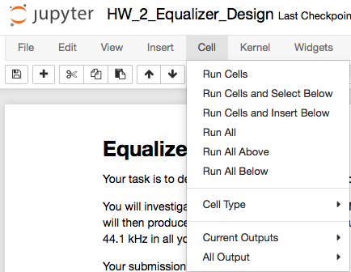
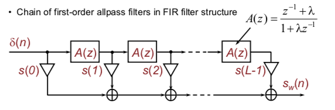

# Aalto Audio Signal Processing

## Dependency
- Anaconda or [Miniconda](https://conda.io/en/latest/miniconda.html)
```
# On macOS,
curl -O https://repo.anaconda.com/miniconda/Miniconda3-latest-MacOSX-x86_64.sh

# Run the installer
bash Miniconda3-latest-MacOSX-x86_64.sh
```

## Installation
```
make init

# Validate your installation
python -c 'import asp; print("asp installation ok.")'
```

## How to validate Homework
```
. activate asp
jupyter notebook

# Navigate to `homework/` and open relevant homework
```
To run an entire notebook, click "Run All"




## Miscellaneous



## References
- http://www.musicdsp.org/files/Audio-EQ-Cookbook.txt
